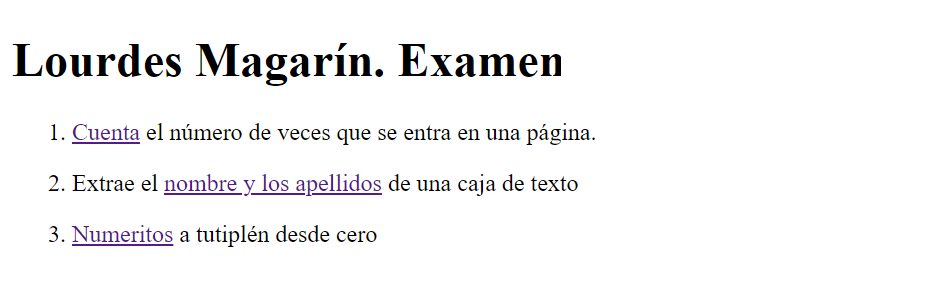
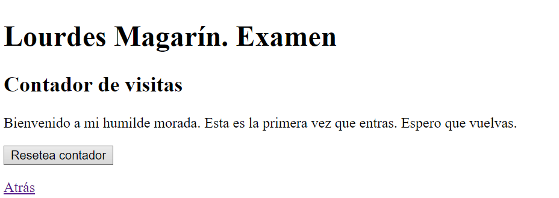
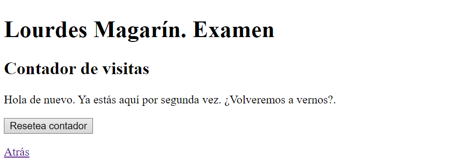
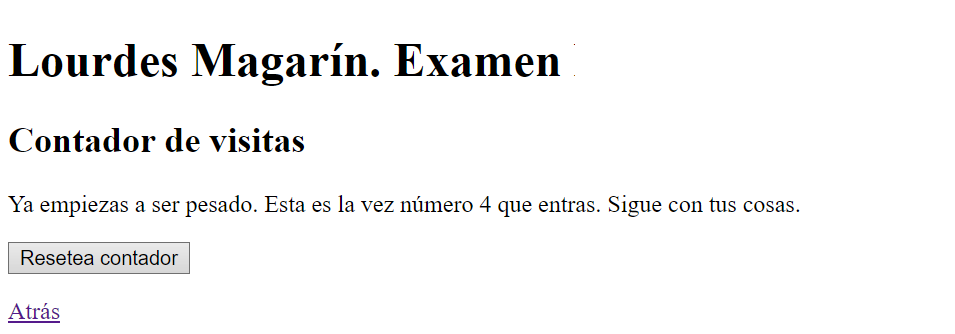
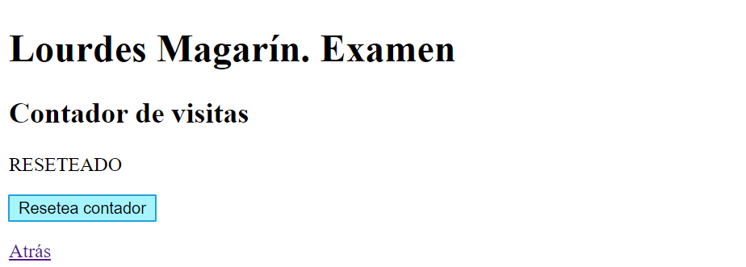
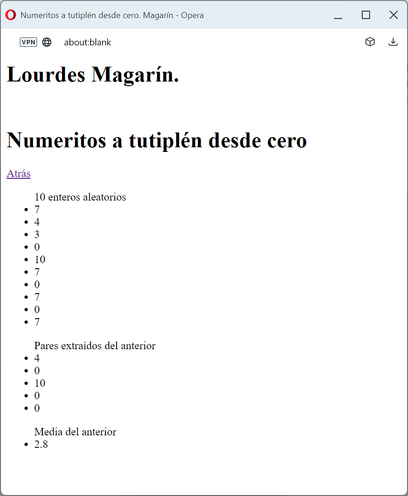

# Examen recuperación primer trimestre. Marzo de 2024
Instrucciones del examen

1. Para el examen de recuperación entrega SÓLO 
   1. Ejercicio 1. Contador
   2. Ejercicio 4. Numeritos
2. Cumple las buenas prácticas y todo lo visto durante el curso.
3.  El código será generado por el alumno en el momento del examen. No se permite reutilizar  el código ni el uso de snippers ni similares
4.  Entrega el examen en el este repositorio
5.  Activa el hosting e indícalo en el título de este README

## Página principal.
1. Reproduce la siguiente página principal. 
2. No uses CSS, ni bucle for, ni if/else
4. Los enlaces abrirán una ventana en la misma pestaña actual.
5. Todas las páginas volverán a esta primera con el enlace atrás. Usa el objeto predefinido que lo permite.

|  |
|-|

## Ejercicio 1. Contador
Contabiliza el número de veces que se entra en esa página. 
1. Utiliza las template string en la función **mostrarBienvenida**, que devuelve una cadena e incrusta el contador almacenado en el storage de la ventana.
2. El mensaje variará en función del argumento recibido
3. A partir de la tercera visita sólo cambiará el número

|  |
|-|

|  |
|-|

|  |
|-|

|  |
|-|

<!-- ## Ejercicio 2. Apellidos y nombre
1. Extrae el nombre y los apellidos introducidos en la caja de texto
2. Introduce tu nombre y apellidos separados por coma.

 |
|-|

3. Al perder el foco (evento blur) se limpiará la caja de texto y aparecerán en los div indicados.

|  |
|-|

|  |
|-|

4. En caso de no cumplirse el formato se capturará la excepción y se mostrará el mensaje indicado en el span. 

5. En tal caso se mostrará el mensaje de error: “Error. Formato correcto: Cuadrado Perfecto, Anacleto”

|  |
|-|
6. Para extraer nombre y apellidos usa los grupos de las expresiones regulares y el destructuring. 
7. Usa el destructuring también al devolver los valores.
8.  Entradas válidas:
    1. Peláez del Cariño, Rocío
    2. Redondo Carrillo, Manuela
    3. Carrillo, Manuela
    4. Carrillo&nbsp;&nbsp;&nbsp;&nbsp;,&nbsp;&nbsp;&nbsp;&nbsp;Manuela
9.  Valores inválidos
    1.  1 2, 3
    2.  Carrillo, Manuela Fernández, Antonio

## Ejercicio 3. Repetidos

Por cada apellidos y nombre repetidos se mostrará la palabra REPETIDO.
Para ello usa una collection Set. 
|  |
|-| -->

## Ejercicio 4. Numeritos

Partiendo de un documento vacío (se crea la ventana desde JavaScript) debes mostrar tres listas con los siguientes arrays:
1. Array de enteros aleatorios entre 0 y 10
2. Array de los números pares extraídos del anterior
3. Array con la media del array anterior 

Para mostrar las listas crea la función generar() 
 

